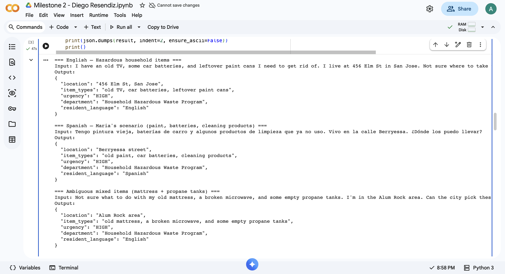
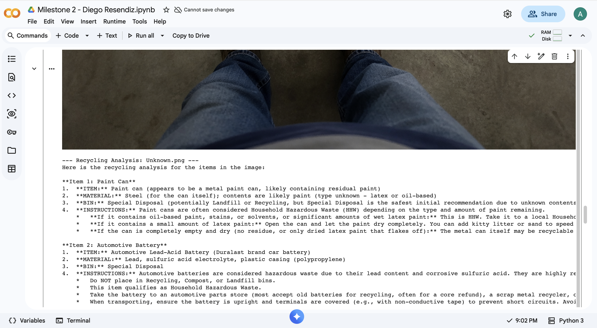
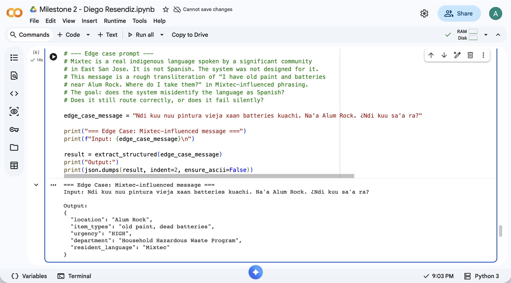

# AI Waste Sorting Assistant (San Jose)

## Team Members
- Diego Resendiz
- Alexa Gonzalez
- Rory Wilson

## Problem

This project focuses on Maria, a tenant living in a multi-unit apartment building in San Jose, who is trying to dispose of household waste correctly but is unsure which items belong in recycling, compost, or landfill. The failure point is not a lack of information, but that existing waste-sorting rules are difficult to interpret at the moment of disposal. For example, when Maria encounters items like greasy pizza boxes, plastic-lined cups, or biodegradable plastics, she does not know which bin to use. This leads to incorrect sorting, contamination of recycling streams, and inefficiencies in waste management. This problem aligns with UN SDG 11: Sustainable Cities and Communities.

## AI Capability

This system uses two AI capabilities demonstrated in the labs:

- **Structured Data Extraction (Lab 2):** Converts user text input into structured categories (recycling, compost, landfill). This helps users quickly understand how to sort multiple items at once.
- **Image Recognition (Lab 3):** Analyzes uploaded images of waste or bins, identifies objects, and determines urgency and recommended actions.

These capabilities directly address the failure point by transforming confusing or unclear waste information into simple, actionable outputs. The system was adapted from the Gemini lab notebooks and modified for waste-sorting scenarios.

## Workflow

**Input:**
- User types a description of waste items  
  Example: “I have leftover food, plastic bottles, and cardboard boxes”
- OR uploads an image of waste or bins

**AI Processing:**
- Extracts individual items from text input
- Classifies each item into categories (recycling, compost, landfill)
- For images, identifies objects and evaluates waste conditions (e.g., overflow, contamination)

**Output:**
- Structured list of items with disposal categories
- Clear instructions for each item
- Image-based analysis including urgency and recommended action

**Real-World Action:**
- Tenant correctly sorts waste into appropriate bins
- Tenant reports issues such as overflowing or contaminated bins
- Improves waste management and reduces environmental harm

**Screenshots:**

## Failure Case

The primary failure case in this system is its limited ability to support users who communicate in languages outside the system’s expected set, such as Mixtec.

Prompt: "Ndi kuu nuu pintura vieja xaan batteries kuachi. Na'a Alum Rock. ¿Ndi kuu sa'a ra?"

Observed Output:
The AI was able to extract key information such as location and item types and correctly identified the language as Mixtec.

Failure:
While the system correctly detected the language, it does not have the ability to respond in Mixtec or provide guidance tailored to that user. This creates a functional failure: the system processes the input internally but cannot deliver a usable output to the person who submitted it.

Real-World Consequence:
A tenant who speaks Mixtec may receive a response they cannot understand or may not receive a response at all. As a result, they are effectively excluded from the system and may continue to dispose of hazardous items incorrectly due to lack of accessible guidance.

This failure was tested directly in our Milestone 2 notebook. It highlights a different kind of risk than misclassification: the system appears to work, but fails to serve the user it was intended to help. The Styrofoam example shows a correctness failure, while this case shows an accessibility failure.

## Oversight and Tradeoff

Oversight Decision:
Human review is required when the system detects a language it cannot reliably support. In this case, although the AI identified Mixtec correctly, it cannot generate a usable response. A human operator must intervene to translate the request and provide instructions in a language the user understands.

The One Change:
The system will flag unsupported or low-resource languages and route those requests to a human translator or multilingual support staff instead of attempting to respond automatically.

Tradeoff:
This introduces delays and requires additional staffing resources. For example, a tenant submitting a request in Mixtec may not receive an immediate response and will need to wait for human assistance. However, this tradeoff ensures that the system remains accessible and does not exclude users who fall outside the model’s supported language range.
